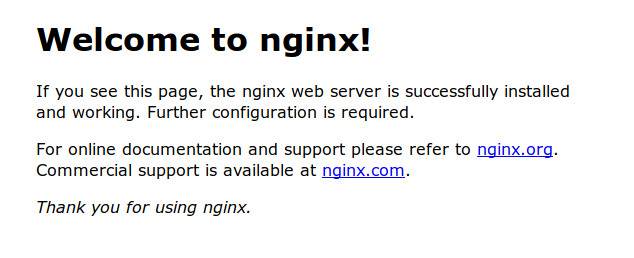
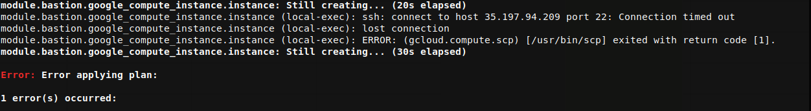

# Three examples of securing applications in Kubernetes Engine

## Table of Contents

<!-- TOC -->

* [Introduction](#introduction)
* [Architecture](#architecture)
* [Prerequisites](#prerequisites)
  * [Tools](#tools)
  * [Versions](#versions)
* [Deployment](#deployment)
  * [Authenticate gcloud](#authenticate-gcloud)
  * [Configure gcloud settings](#configuring-gcloud-settings)
  * [Setup this project](#setup-this-project)
  * [Cluster Deployment](#cluster-deployment)
  * [Provisioning the Kubernetes Engine Cluster](#provisioning-the-kubernetes-engine-cluster)
* [Validation](#validation)
* [Set up Nginx](#set-up-nginx)
* [Set up AppArmor-loader](#set-up-apparmor-loader)
* [Set up Pod-labeler](#set-up-pod-labeler)
* [Tear down](#tear-down)
* [Troubleshooting](#troubleshooting)
* [Relevant Material](#relevant-material)
* [Key Takeaways](#key-takeaways)

<!-- TOC -->

## Introduction

This tutorial demonstrates how Kubernetes Engine security features can be used to grant varying levels of privilege to applications, based on their particular requirements.

When configuring security, applications should be granted the smallest set of privileges that still allows them to operate correctly. When applications have more privileges than they need then they are more dangerous when compromised. In a Kubernetes cluster, these privileges can be grouped into the following broad levels:

* **Host access:** describes what permissions an application has on it's host node, outside of its container. This is controlled via Pod and Container security contexts, as well as app armor profiles.
* **Network access:** describes what other resources or workloads an application can access via the network. This is controlled with NetworkPolicies.
* **Kubernetes API access:** describes which API calls an application is allowed to make against. API access is controlled using the Role Based Access Control (RBAC) model via Role and RoleBinding definitions.

In the sections below, you will explore three scenarios with distinct security
requirements at each of these levels:

| Scenario | Host Access | Network Access  | Kubernetes API Access |
|---|---|---|---|
| Hardened Web Server (NGINX) | Minimal | Must be able to serve port 80 | None |
| Kubernetes Controller (Demo) | Minimal | Must be able to access the API Server | List and Patch Pods |
| Privileged Daemonset (AppArmor Loader) | Privileged  | None | None |

## Architecture

The tutorial uses three applications to illustrate the scenarios described above:

### Hardened Web Server (nginx)

Creates an nginx deployment whose pods have their host-level access restricted by an AppArmor profile and whose network connectivity is restricted by a NetworkPolicy.

### System Daemonset (AppArmor Loader)

Creates a daemonset responsible for loading (installing) the app armor profile applied to the nginx pods on each node. Loading profiles requires more privileges than can be provided via Capabilities, so it's containers are given full privileges via their SecurityContexts.

### Simplified Kubernetes Controller (Pod Labeler)

The pod-labeler deployment creates a single pod that watches all other pods in the default namespace and periodically labels them. This requires access to the Kubernetes API server - which is configured via RBAC using a ServiceAccount, Role, and RoleMapping.

## Prerequisites

### Tools

In order to use the code in this demo you will need access to the following tools:

* A bash, or bash-compatible, shell
* Access to an existing Google Cloud project with the [Kubernetes Engine v1.10.0 or later](https://cloud.google.com/kubernetes-engine/docs/quickstart#before-you-begin) service enabled
* If you do not have a Google Cloud Platform account you can sign up [here](https://cloud.google.com) and get 300 dollars of free credit on your new account.
* [Google Cloud SDK (200.0.0 or later)](https://cloud.google.com/sdk/downloads)
* [HashiCorp Terraform v0.11.7](https://www.terraform.io/downloads.html)
* [gcloud](https://cloud.google.com/sdk/gcloud/)
* [kubectl](https://kubernetes.io/docs/reference/kubectl/overview/) (comes with gcloud)

### Versions

* Terraform v0.11.7
* gcloud v206.0.0
* kubectl v1.10.4
* Kubernetes Engine v1.10

## Deployment

The steps below will walk you through using terraform to deploy a Kubernetes Engine cluster that you will then use for installing a pod that uses an AppArmor profile and another pod that securely interacts with the Kubernetes API.

### Authenticate gcloud

Prior to running this demo, ensure you have authenticated your gcloud client by running the following command:

```console
gcloud auth application-default login
```

### Setup this project

This project requires the following Google Cloud Service APIs to be enabled:

* `compute.googleapis.com`
* `container.googleapis.com`
* `cloudbuild.googleapis.com`

In addition, the terraform configuration takes three parameters to determine where the Kubernetes Engine cluster should be created:

* `project`
* `region`
* `zone`

For simplicity, these parameters are to be specified in a file named `terraform.tfvars`, in the `terraform` directory. To ensure the appropriate APIs are enabled and to generate the `terraform/terraform.tfvars` file based on your gcloud defaults, run:

```console
make setup-project
```

This will enable the necessary Service APIs, and it will also generate a `terraform/terraform.tfvars` file with the following keys. The values themselves will match the output of `gcloud config list`:

```console
cat terraform/terraform.tfvars

project="YOUR_PROJECT"
region="YOUR_REGION"
zone="YOUR_ZONE"
```

If you need to override any of the defaults, simply replace the desired value(s) to the right of the equals sign(s). Be sure your replacement values are still double-quoted.

### Provisioning the Kubernetes Engine Cluster

Next, apply the terraform configuration with:

```console
# From within the project root, use make to apply the terraform
make tf-apply
```

When prompted if you want to deploy the plan, review the generated plan and enter `yes` to deploy the environment.

## Validation

Once complete, terraform will output a message indicating successful creation of the cluster.

```console
...snip...
google_container_cluster.primary: Still creating... (3m20s elapsed)
google_container_cluster.primary: Still creating... (3m30s elapsed)
google_container_cluster.primary: Creation complete after 3m33s (ID: gke-security-demo)

Apply complete! Resources: 7 added, 0 changed, 0 destroyed.
```

Once the apply completes, ssh to the bastion host:

```command
gcloud compute ssh gke-tutorial-bastion
```

and execute:

```command
kubectl get pods --all-namespaces

NAMESPACE     NAME                                                          READY     STATUS        RESTARTS   AGE
kube-system   calico-node-g7mlz                                             2/2       Running       0          56s
kube-system   calico-node-rzbbc                                             2/2       Running       0          56s
kube-system   calico-node-vertical-autoscaler-8b959b949-tnwhm               1/1       Running       0          2m
kube-system   calico-node-vnw26                                             2/2       Running       0          56s
kube-system   calico-typha-dbf7c7b6d-bpm2r                                  1/1       Running       0          1m
kube-system   calico-typha-horizontal-autoscaler-5545fbd5d6-4wbgg           1/1       Running       0          2m
kube-system   calico-typha-vertical-autoscaler-54d8f88b84-2pwdz             1/1       Running       0          2m
kube-system   event-exporter-v0.2.1-5f5b89fcc8-vb5bc                        2/2       Running       0          2m
kube-system   fluentd-gcp-scaler-7c5db745fc-hcpr5                           1/1       Running       0          1m
kube-system   fluentd-gcp-v3.0.0-ks89p                                      2/2       Running       0          1m
kube-system   fluentd-gcp-v3.0.0-mfbg4                                      2/2       Running       0          1m
kube-system   heapster-v1.5.3-7ff6c8d4cc-tbf8d                              3/3       Running       0          1m
kube-system   ip-masq-agent-f8kdp                                           1/1       Running       0          1m
kube-system   ip-masq-agent-h7fbh                                           1/1       Running       0          1m
kube-system   ip-masq-agent-nlkl9                                           1/1       Running       0          1m
kube-system   kube-dns-788979dc8f-c6zv4                                     4/4       Running       0          1m
kube-system   kube-dns-788979dc8f-xt97h                                     4/4       Running       0          2m
kube-system   kube-dns-autoscaler-79b4b844b9-cmhns                          1/1       Running       0          1m
kube-system   kube-proxy-gke-gke-security-demo-default-pool-a55f1c91-6lxr   1/1       Running       0          1m
kube-system   kube-proxy-gke-gke-security-demo-default-pool-a55f1c91-7smw   1/1       Running       0          1m
kube-system   kube-proxy-gke-gke-security-demo-default-pool-a55f1c91-9khs   1/1       Running       0          1m
kube-system   l7-default-backend-5d5b9874d5-57mb5                           1/1       Running       0          2m
kube-system   metrics-server-v0.2.1-7486f5bd67-f68bq                        2/2       Running       0          1m
```

## Set up Nginx

Again on the bastion host, execute:

```command
kubectl apply -f manifests/nginx.yaml

deployment.apps/nginx created
service/nginx-lb created
networkpolicy.networking.k8s.io/nginx-from-external created
```

Then execute:

```command
kubectl get pods

NAME                     READY     STATUS    RESTARTS   AGE
nginx-775877bc7b-5hk65   0/1       Blocked   0          13s
nginx-775877bc7b-jwcv9   0/1       Blocked   0          13s
nginx-775877bc7b-xc7p2   0/1       Blocked   0          13s
```

You should see that while the pods have been created, they're in a blocked state. The nginx pods are blocked because the manifest includes an AppArmor profile that doesn't exist on the nodes:

```yaml
...
    metadata:
      annotations:
        container.apparmor.security.beta.kubernetes.io/nginx: localhost/k8s-nginx
...
```

We can confirm this by executing the following command showing the `Message` field:

```command
kubectl describe pod -l app=nginx

...snip...
Labels:         app=nginx
                pod-template-hash=3314336736
Annotations:    container.apparmor.security.beta.kubernetes.io/nginx=localhost/k8s-nginx
                kubernetes.io/limit-ranger=LimitRanger plugin set: cpu request for container nginx
Status:         Pending
Reason:         AppArmor
Message:        Cannot enforce AppArmor: profile "k8s-nginx" is not loaded
IP:
Controlled By:  ReplicaSet/nginx-775877bc7b
Containers:
  nginx:
    Container ID:
...snip...
```

## Set up AppArmor-loader

In order to resolve this, the relevant AppArmor profile must be loaded. because we don't know on which nodes the nginx pods will be allocated, we must deploy the AppArmor profile to all nodes. The way you'll deploy this, ensuring all nodes are covered, is via a daemonset

[https://kubernetes.io/docs/concepts/workloads/controllers/daemonset/#what-is-a-daemonset](https://kubernetes.io/docs/concepts/workloads/controllers/daemonset/#what-is-a-daemonset).

The included apparmor-loader.yaml is the manifest that is highly privileged, as it needs to write a file onto each node. The contents of that file are in the configmap included in the same; in order to deploy it, execute:

```console
# On the bastion host
kubectl apply -f manifests/apparmor-loader.yaml

namespace/apparmor created
configmap/apparmor-profiles created
daemonset.apps/apparmor-loader created
networkpolicy.networking.k8s.io/deny-apparmor-communication created
```

The nginx nodes are in backoff by this point, so the fastest way to resolve it is by deleting the existing nginx pods and allowing kubernetes to re-create them:

```console
# On the bastion host
kubectl delete pods -l app=nginx

pod "nginx-775877bc7b-5hk65" deleted
pod "nginx-775877bc7b-jwcv9" deleted
pod "nginx-775877bc7b-xc7p2" deleted
```

After which, we can confirm that nginx is running successfully with:

```console
kubectl get pods

NAME                     READY     STATUS    RESTARTS   AGE
nginx-775877bc7b-n2rxx   1/1       Running   0          28s
nginx-775877bc7b-q7qfb   1/1       Running   0          28s
nginx-775877bc7b-zzbdl   1/1       Running   0          28s
```

Another test that will show the successful deployment of nginx is by executing:

```console
kubectl get services

NAME         TYPE           CLUSTER-IP      EXTERNAL-IP     PORT(S)        AGE
kubernetes   ClusterIP      10.137.0.1      <none>          443/TCP        7m
nginx-lb     LoadBalancer   10.137.15.122   [NGINX_IP]      80:30033/TCP   54s
```

the external IP listed by the nginx-lb is publicly accessible and can reached with curl, wget, or a web browser. Navigating to the IP displayed in place of [NGINX_IP] above, you will see:



## Set up Pod-labeler

In this scenario you'll go through the process of deploying an application that requires access to the Kubernetes API. This pod will update the metadata of other pods.

First execute:

```console
kubectl get pods --show-labels

NAME                          READY     STATUS              RESTARTS   AGE       LABELS
nginx-d99fc9b6c-ff6hw         1/1       Running             0          4m        app=nginx,pod-template-hash=855975627
nginx-d99fc9b6c-m7gc2         1/1       Running             0          4m        app=nginx,pod-template-hash=855975627
nginx-d99fc9b6c-zbkf9         1/1       Running             0          4m        app=nginx,pod-template-hash=855975627
```

Now execute:

```console
kubectl apply -f manifests/pod-labeler.yaml

role.rbac.authorization.k8s.io/pod-labeler created
serviceaccount/pod-labeler created
rolebinding.rbac.authorization.k8s.io/pod-labeler created
deployment.apps/pod-labeler created
```

This can take up to two minutes to finish the creation of the new pod, but once this has finished, re-execute:

```console
kubectl get pods --show-labels

NAME                          READY     STATUS    RESTARTS   AGE       LABELS
nginx-d99fc9b6c-ff6hw         1/1       Running   0          5m        app=nginx,pod-template-hash=855975627,updated=1530656545.33
nginx-d99fc9b6c-m7gc2         1/1       Running   0          5m        app=nginx,pod-template-hash=855975627,updated=1530656545.35
nginx-d99fc9b6c-zbkf9         1/1       Running   0          5m        app=nginx,pod-template-hash=855975627,updated=1530656545.36
pod-labeler-8845f6488-px9hl   1/1       Running   0          55s       app=pod-labeler,pod-template-hash=440192044,updated=1530656545.38
```

And you'll see that the pods have an additional "updated=..." label.

## Tear down

The test cluster can be completely torn down with the following command (type `yes` at the prompt to confirm)

```command
make tf-destroy

...snip...
module.network.google_compute_subnetwork.cluster-subnet: Destruction complete after 26s
module.network.google_compute_network.gke-network: Destroying... (ID: kube-net)
module.network.google_compute_network.gke-network: Still destroying... (ID: kube-net, 10s elapsed)
module.network.google_compute_network.gke-network: Still destroying... (ID: kube-net, 20s elapsed)
module.network.google_compute_network.gke-network: Destruction complete after 25s

Destroy complete! Resources: 7 destroyed.
```

## Troubleshooting

### The install script fails with a `Permission denied` when running Terraform

The credentials that Terraform is using do not provide the necessary permissions to create resources in the selected projects. Ensure that the account listed in `gcloud config list` has necessary permissions to create resources. If it does, regenerate the application default credentials using `gcloud auth application-default login`.

### Error during scp

Occasionally, the gke-tutorial-bastion host will not be ready for the subsequent `scp` command, in this case there will be an error that looks like:  If this happens, simply re-run `make tf-apply`.

### Invalid fingerprint error during Terraform operations

Terraform occasionally complains about an invalid fingerprint, when updating certain resources. If you see the error below, simply re-run the command. 

## Relevant Material

* [AppArmor](https://kubernetes.io/docs/tutorials/clusters/apparmor/)
* [Terraform - Kubernetes Engine](https://www.terraform.io/docs/providers/google/r/container_cluster.html)
* [Bastion Host](https://en.wikipedia.org/wiki/Bastion_host)
* [RBAC](https://kubernetes.io/docs/reference/access-authn-authz/rbac/)
* [Securing Kubernetes Engine](https://cloud.google.com/kubernetes-engine/docs/how-to/hardening-your-cluster)
* [Security Contexts](https://kubernetes.io/docs/tasks/configure-pod-container/security-context/)

**This is not an officially supported Google product**
